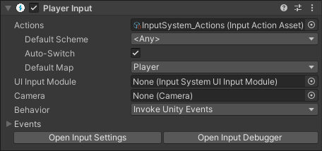

# Input Action Assets

- [Creating Input Action Assets](#creating-input-action-assets)
- [Editing Input Action Assets](#editing-input-action-assets)
- [Using Input Action Assets](#using-input-action-assets)
- [Type-safe C# API Generation](#type-safe-c-api-generation)

An Input Action Asset is an Asset which contains a set of [Input Actions](Actions.md) definitions and their associated [Bindings](ActionBindings.md) and [Control Schemes](ActionBindings.md#control-schemes). These Assets have the `.inputactions` file extension and are stored in a plain JSON format.

The input system creates an Action Asset when you set up the [default project-wide actions](ProjectWideActions.md), but you can also create new Action Assets directly in the Project window.

For most common scenarios, you do not need to use more than one Input Action Asset. It is usually simpler to configure your project-wide action definition in the Project Settings window.


## Creating Input Action Assets

To create an Asset that contains [Input Actions](Actions.md) in Unity, right-click in the __Project__ window or go to __Assets > Create > Input Actions__ from Unity's main menu.

## Editing Input Action Assets

To bring up the Action editor, double-click an `.inputactions` Asset in the Project Browser, or select the __Edit Asset__ button in the Inspector for that Asset. You can have more than one editor window open at the same time, but not for the same Asset.

The Actions Editor which opens is identical to the [Actions Editor in the Project Settings window](ActionsEditor.md).


## Using Input Action Assets


## Type-safe C# API Generation

Input Action Assets have a feature that is not present for project-wide actions, which is that you can **generate a C# class** from your action definitions, which allow you to refer to your actions in a type-safe manner from code. This means you can avoid looking up your actions by string.

### Auto-generating script code for Actions

One of the most convenient ways to work with `.inputactions` Assets in scripts is to automatically generate a C# wrapper class for them. This removes the need to manually look up Actions and Action Maps using their names, and also provides an easier way to set up callbacks.

To enable this option, tick the __Generate C# Class__ checkbox in the importer properties in the Inspector of the `.inputactions` Asset, then select __Apply__.


You can optionally choose a path name, class name, and namespace for the generated script, or keep the default values.

This generates a C# script that simplifies working with the Asset.

```CSharp
using UnityEngine;
using UnityEngine.InputSystem;

// IGameplayActions is an interface generated from the "gameplay" action map
// we added (note that if you called the action map differently, the name of
// the interface will be different). This was triggered by the "Generate Interfaces"
// checkbox.
public class MyPlayerScript : MonoBehaviour, IGameplayActions
{
    // MyPlayerControls is the C# class that Unity generated.
    // It encapsulates the data from the .inputactions asset we created
    // and automatically looks up all the maps and actions for us.
    MyPlayerControls controls;

    public void OnEnable()
    {
        if (controls == null)
        {
            controls = new MyPlayerControls();
            // Tell the "gameplay" action map that we want to get told about
            // when actions get triggered.
            controls.gameplay.SetCallbacks(this);
        }
        controls.gameplay.Enable();
    }

    public void OnDisable()
    {
        controls.gameplay.Disable();
    }

    public void OnUse(InputAction.CallbackContext context)
    {
        // 'Use' code here.
    }

    public void OnMove(InputAction.CallbackContext context)
    {
        // 'Move' code here.
    }

}
```

>__Note__: To regenerate the .cs file, right-click the .inputactions asset in the Project Browser and choose "Reimport".

### Using Action Assets with `PlayerInput`

The [Player Input](PlayerInput.md) component provides a convenient way to handle input for one or multiple players. You can assign your Action Asset to the Player Input component so that it can then automatically handle activating Action Maps and selecting Control Schemes for you.



### Modifying Input Action Assets at runtime
There are several ways to modify an Input Action Asset at runtime. Any modifications that you make during Play mode to an Input Action Asset do not persist in the Input Action Asset after you exit Play mode. This means you can test your application in a realistic manner in the Editor without having to worry about inadvertently modifying the asset. For examples on how to modify an Input Action Asset, see the documentation on [Creating Actions in code](Actions.md#creating-actions-in-code) and [Changing Bindings](ActionBindings.md#changing-bindings).


### The Default Actions Asset

An asset called `DefaultInputActions.inputactions` containing a default setup of Actions comes with the Input System Package. You can reference this asset directly in your projects like any other Unity asset. However, the asset is also available in code form through the [`DefaultInputActions`](../api/UnityEngine.InputSystem.DefaultInputActions.html) class.

```CSharp
void Start()
{
    // Create an instance of the default actions.
    var actions = new DefaultInputActions();
    actions.Player.Look.performed += OnLook;
    actions.Player.Move.performed += OnMove;
    actions.Enable();
}
```

> __Note:__ This default actions asset is older than, and entirely separate from the [default project-wide actions](ProjectWideActions.md). It is a legacy asset that remains included in the package for backward compatibility.
