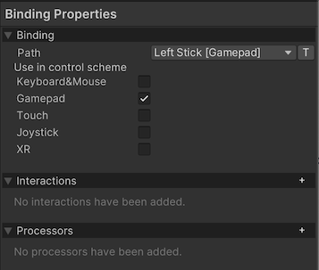
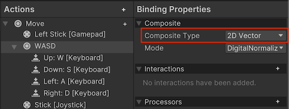
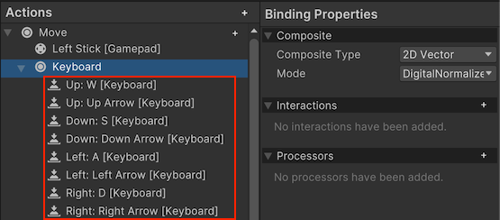

# Configuring Input

The **Input Actions Editor** allows you to configure [Input Actions](Actions.md) and their associated [Bindings](ActionBindings.md) and [Control Schemes](ActionBindings.md#control-schemes).

Open the Input Actions settings by going to **Edit** > **Project Settings** > **Input System Package** > **Input Actions**


*The Input Actions editor in the Project Settings window*

The Input Action editor is divided into three panels (marked A, B & C above).

|Name|Description|
|-|-|
|**A: Action Maps**|Displays the list of currently defined Action Maps. Each Action Map is a collection of Actions that you can enable or disable together as a group.|
|**B: Actions**|Displays all the actions defined in the currently selected Action Map, and the bindings associated with each Action.|
|**C: Properties**|Displays the properties of the currently selected Action or Binding from the Actions panel. The title of this panel changes depending on whether you have an Action or a Binding selected in the Actions panel.|


**Action Properties** define the type of input that relates to the action, such as whether it is a button press, or a movement axis.

[**Control Schemes**](ActionsEditor.html#editing-control-schemes) refer to particular modes of input, such as "Joypad" or "Keyboard and Mouse". You can specify which bindings belong to particular control schemes. You might have one control scheme which is "Joypad", and another control scheme which is "Keyboard and Mouse". This allows you to determine which control scheme the user is currently using, so your game can respond to the user accordingly. This feature is often used to adapt the in-game UI to show the correct keys or buttons in on-screen prompts.


### Configure Action Maps


* To add a new Action Map, select the Add (+) icon in the header of the Action Map panel.
* To rename an existing Action Map, either long-click the name, or right-click the Action Map and select __Rename__ from the context menu. Note that Action Map names can't contain slashes  (`/`).
* To delete an existing Action Map, right-click it and select __Delete__ from the context menu.
* To duplicate an existing Action Map, right-click it and select __Duplicate__ from the context menu.

### Editing Actions

* To add a new Action, select the Add (+) icon in the header of the Action column.
* To rename an existing Action, either long-click the name, or right-click the Action Map and select __Rename__ from the context menu.
* To delete an existing Action, either right-click it and select __Delete__ from the context menu.
* To duplicate an existing Action, either right-click it and select __Duplicate__ from the context menu.

If you select an Action, you can edit its properties in the right-hand pane of the window:


### Editing Bindings

* To add a new Binding, select the Add (+) icon on the action you want to add it to, and select the binding type from the menu that appears.
* To delete an existing Binding, either right-click it and select __Delete__ from the context menu.
* To duplicate an existing Binding, either right-click it and select __Duplicate__ from the context menu.

If you select a Binding, you can edit its properties in the right-hand pane of the window:



#### Picking Controls

The most important property of any Binding is the [control path](Controls.md#control-paths) it's bound to. To edit it, open the __Path__ drop-down list. This displays a Control picker window.


In the Control picker window, you can explore a tree of Input Devices and Controls that the Input System recognizes, and bind to these Controls. Unity filters this list by the Action's [`Control Type`](../api/UnityEngine.InputSystem.InputAction.html#UnityEngine_InputSystem_InputAction_expectedControlType) property. For example, if the Control type is `Vector2`, you can only select a Control that generates two-dimensional values, like a stick.

The Device and Control tree is organized hierarchically from generic to specific. For example, the __Gamepad__ Control path `<Gamepad>/buttonSouth` matches the lower action button on any gamepad. Alternatively, if you navigate to __Gamepad__ > __More Specific Gamepads__ and select __PS4 Controller__, and then choose the Control path `<DualShockGamepad>/buttonSouth`, this only matches the "Cross" button on PlayStation gamepads, and doesn't match any other gamepads.

Instead of browsing the tree to find the Control you want, it's easier to let the Input System listen for input. To do that, select the __Listen__ button. At first, the list of Controls is empty. Once you start pressing buttons or actuating Controls on the Devices you want to bind to, the Control picker window starts listing any Bindings that match the controls you pressed. Select any of these Bindings to view them.

Finally, you can choose to manually edit the Binding path, instead of using the Control picker. To do that, select the __T__ button next to the Control path popup. This changes the popup to a text field, where you can enter any Binding string. This also allows you to use wildcard (`*`) characters in your Bindings. For example, you can use a Binding path such as `<Touchscreen>/touch*/press` to bind to any finger being pressed on the touchscreen, instead of manually binding to `<Touchscreen>/touch0/press`, `<Touchscreen>/touch1/press` and so on.

#### Editing Composite Bindings

Composite Bindings are Bindings consisting of multiple parts, which form a Control together. For instance, a [2D Vector Composite](ActionBindings.md#2d-vector) uses four buttons (left, right, up, down) to simulate a 2D stick input. See the [Composite Bindings](ActionBindings.md#composite-bindings) documentation to learn more.


To create a Composite Binding, in the Input Action Asset editor window, select the Add (+) icon on the Action you want to add it to, and select the Composite Binding type from the popup menu.


This creates multiple Binding entries for the Action: one for the Composite as a whole, and then, one level below that, one for each Composite part. The Composite itself doesn't have a Binding path property, but its individual parts do, and you can edit these parts like any other Binding. Once you bind all the Composite's parts, the Composite can work together as if you bound a single control to the Action.

**Note**: The set of Composites displayed in the menu is depends on the value type of the Action. This means that, for example, if the Action is set to type "Button", then only Composites able to return values of type `float` will be shown.

To change the type of a Composite retroactively, select the Composite, then select the new type from the **Composite Type** drop-down in the **Properties** pane.



To change the part of the Composite to which a particular Binding is assigned, use the **Composite Part** drop-down in the Binding's properties.


You can assign multiple Bindings to the same part. You can also duplicate individual part Bindings: right-click the Binding, then select **Duplicate** to create new part Bindings for the Composite. This can be used, for example, to create a single Composite for both "WASD" style controls and arrow keys.



### Editing Control Schemes

Input Action Assets can have multiple [Control Schemes](ActionBindings.md#control-schemes), which let you enable or disable different sets of Bindings for your Actions for different types of Devices.


To see the Control Schemes in the Input Action Asset editor window, open the Control Scheme drop-down list in the top left of the window. This menu lets you add or remove Control Schemes to your Asset. If the Asset contains any Control Schemes, you can select a Control Scheme, and then the window only shows bindings that belong to that Scheme. If you select a binding, you can now pick the Control Schemes for which this binding should be active in the __Properties__ view to the left of the window. When you add a new Control Scheme, or select an existing Control Scheme, and then select __Edit Control Scheme…__, you can edit the name of the Control Scheme and which devices the Scheme should be active for.

## Using Input Action Assets

### The Automaticaly-generated InputActions API

The most convenient ways to work with your Input Actions in scripts is to use the automatically generated C# API in the InputActions class.

Each Action Map and Action you define in the Input Actions editor has its own corresponding C# member on the InputActions class.

For example, if you have an Action Map called *"Player"* which defines *"Move"* as an Action with a 2D axis, and *"Jump"* as an button-type action, you can use a single line of code to read the values from each of these actions:

```
    // read the default "move" action, which is a 2D vector axis
    Vector2 move = InputActions.player.move.value;

    // read the default "jump" action, which is a true/false button
    bool jump = InputActions.player.jump.isPressed;
```

**Note**: The Action Map and Actions in this example configured as defaults when you install the Input System package.

### Using Actions with the `PlayerInput` component

The [Player Input](PlayerInput.md) component provides a convenient way to handle input for one or multiple players. It requires you to set up all your Actions in the Input Actions editor, which you can then select in the Player Input component. The Player Input component can then automatically handle activating Action Maps and selecting Control Schemes for you.


### Modifying Input Action Assets at runtime

There are several ways to modify an Input Action Asset at runtime. Any modifications that you make during Play mode to an Input Action Asset do not persist in the Input Action Asset after you exit Play mode. This means you can test your application in a realistic manner in the Editor without having to worry about inadvertently modifying the asset. For examples on how to modify an Input Action Asset, see the documentation on [Creating Actions in code](Actions.md#creating-actions-in-code) and [Changing Bindings](ActionBindings.md#changing-bindings).
