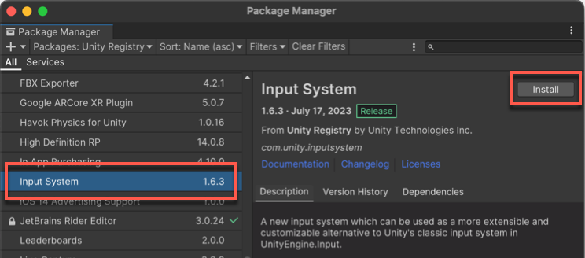

# Installation guide

This guide describes how to install and activate the Input System package for your Unity project.

>__Note__: The new Input System requires Unity 2019.1+ and the .NET 4 runtime. It does not work in projects using the old .NET 3.5 runtime.

## Installing the package

You can install the new Input System using Unity's package manager (menu: __Window > Package Manager__). Make sure you enable the __Show Preview Packages__ option to see the Input System package in the package list.

Select the latest __Input System__ package from the list, then click __Install__.

## Enabling the new input backends

By default, Unity's classic Input Manager is active and support for the new Input System is inactive. This allows existing Unity Project to keep working as they are.

To fully switch from the old Input Manager to the new Input System for a Project:

1. Open the Player settings (menu: __Edit > Project Settings… > Player__).
2. Change Active Input Handling from __Input Manager (Old)__ to __Input System Package (New)__ (or __Input System (Preview)__ in Unity 2019.2 or older).

>__Note__: You must restart the Unity Editor before this setting takes effect.