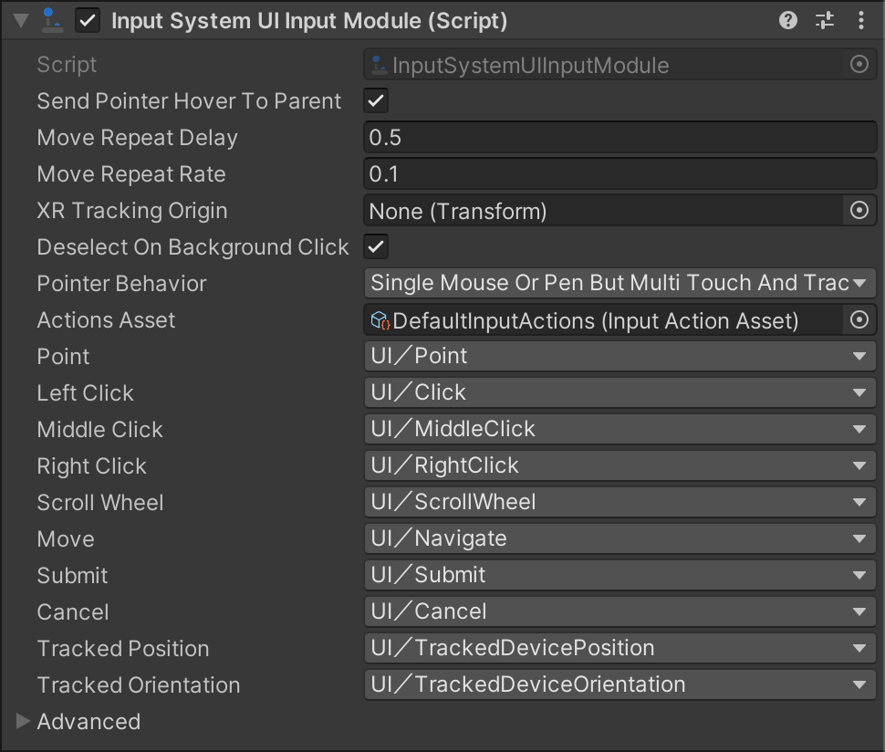
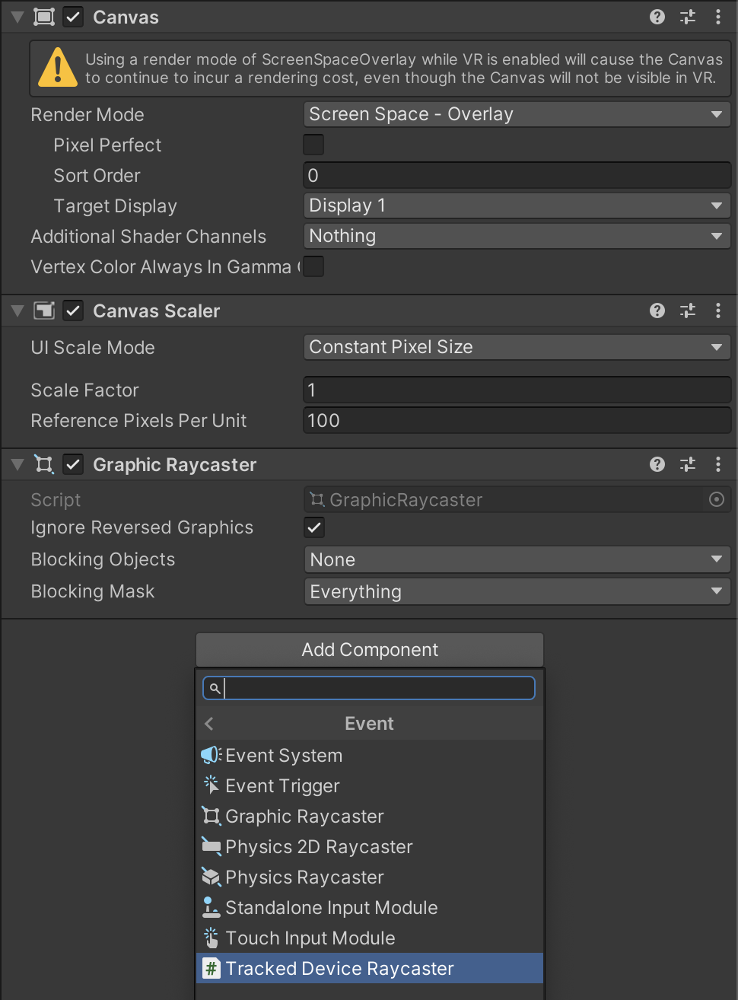
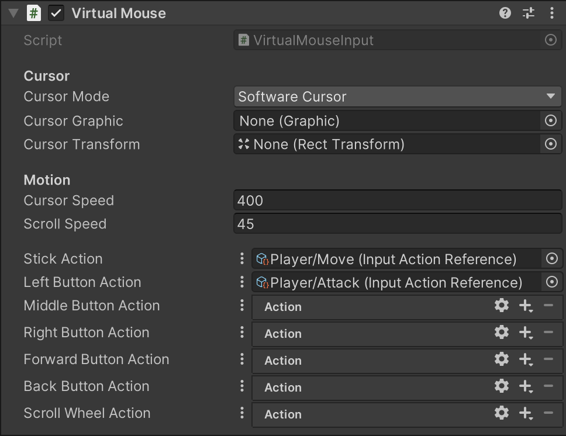

# UI support

* [InputSystemUIInputModule component](#inputsystemuiinputmodule-component)
* [MultiplayerEventSystem component](#multiplayereventsystem-component)
* [VirtualMouseInput component](#virtualmouseinput-component)

You can use the Input System package to control any in-game UI created with the [Unity UI package](https://docs.unity3d.com/Manual/UISystem.html). The integration between the Input System and the UI system is handled by the [InputSystemUIInputModule](../api/UnityEngine.InputSystem.UI.InputSystemUIInputModule.html) component.

>[!NOTE]
>The Input System package does not support IMGUI or UIElements.

## InputSystemUIInputModule component

The [InputSystemUIInputModule](../api/UnityEngine.InputSystem.UI.InputSystemUIInputModule.html) component acts as a drop-in replacement for the [StandaloneInputModule](https://docs.unity3d.com/Manual/script-StandaloneInputModule.html) component that the Unity UI package. [InputSystemUIInputModule](../api/UnityEngine.InputSystem.UI.InputSystemUIInputModule.html) provides the same functionality as  [StandaloneInputModule](https://docs.unity3d.com/Manual/script-StandaloneInputModule.html), but it uses the Input System instead of the legacy Input Manager to drive UI input.

If you have a [StandaloneInputModule](https://docs.unity3d.com/Manual/script-StandaloneInputModule.html) component on a GameObject, and the Input System is installed, Unity shows a button in the Inspector offering to automatically replace it with a [InputSystemUIInputModule](../api/UnityEngine.InputSystem.UI.InputSystemUIInputModule.html) for you. The [InputSystemUIInputModule](../api/UnityEngine.InputSystem.UI.InputSystemUIInputModule.html) is pre-configured to use default Input Actions to drive the UI, but you can override that configuration to suit your needs.

You can use the following properties to configure [InputSystemUIInputModule](../api/UnityEngine.InputSystem.UI.InputSystemUIInputModule.html):

|**Property**|**Description**|
|--------|-----------|
|[Move Repeat Delay](../api/UnityEngine.InputSystem.UI.InputSystemUIInputModule.html#UnityEngine_InputSystem_UI_InputSystemUIInputModule_moveRepeatDelay)|The initial delay (in seconds) between generating an initial [IMoveHandler.OnMove](https://docs.unity3d.com/Packages/com.unity.ugui@1.0/api/UnityEngine.EventSystems.IMoveHandler.html) navigation event and generating repeated navigation events when the __Move__ Action stays actuated.|
|[Move Repeat Rate](../api/UnityEngine.InputSystem.UI.InputSystemUIInputModule.html#UnityEngine_InputSystem_UI_InputSystemUIInputModule_moveRepeatDelay)|The interval (in seconds) between generating repeat navigation events when the __Move__ Action stays actuated. Note that this is capped by the frame rate; there will not be more than one move repeat event each frame so if the frame rate dips below the repeat rate, the effective repeat rate will be lower than this setting.|
|[Actions Asset](../api/UnityEngine.InputSystem.UI.InputSystemUIInputModule.html#UnityEngine_InputSystem_UI_InputSystemUIInputModule_actionsAsset)|An [Input Action Asset](ActionAssets.md) containing all the Actions to control the UI. You can choose which Actions in the Asset correspond to which UI inputs using the following properties.  By default, this references a built-in Asset named *DefaultInputActions*, which contains common default Actions for driving UI. If you want to set up your own Actions, [create a custom Input Action Asset](ActionAssets.md#creating-input-action-assets) and assign it here. When you assign a new Asset reference to this field in the Inspector, the Editor attempts to automatically map Actions to UI inputs based on common naming conventions.|
|[Deselect on Background Click](../api/UnityEngine.InputSystem.UI.InputSystemUIInputModule.html#UnityEngine_InputSystem_UI_InputSystemUIInputModule_deselectOnBackgroundClick)|By default, when the pointer is clicked and does not hit any `GameObject`, the current selection is cleared. This, however, can get in the way of keyboard and gamepad navigation which will want to work off the currently selected object. To prevent automatic deselection, set this property to false.|
|[Pointer Behavior](../api/UnityEngine.InputSystem.UI.InputSystemUIInputModule.html#UnityEngine_InputSystem_UI_InputSystemUIInputModule_pointerBehavior)|How to deal with multiple pointers feeding input into the UI. See [pointer-type input](#pointer-type-input).|

You can use the following properties to map Actions from the chosen [__Actions Asset__](../api/UnityEngine.InputSystem.UI.InputSystemUIInputModule.html#UnityEngine_InputSystem_UI_InputSystemUIInputModule_actionsAsset) to UI input Actions. In the Inspector, these appear as foldout lists that contain all the Actions in the Asset:

|**Property**|**Description**|
|--------|-----------|
|[Point](../api/UnityEngine.InputSystem.UI.InputSystemUIInputModule.html#UnityEngine_InputSystem_UI_InputSystemUIInputModule_point)|An Action that delivers a 2D screen position. Use as a cursor for pointing at UI elements to implement mouse-style UI interactions. See [pointer-type input](#pointer-type-input).  Set to [PassThrough](../api/UnityEngine.InputSystem.InputActionType.html#UnityEngine_InputSystem_InputActionType_PassThrough) Action type and `Vector2` value type.|
|[Left Click](../api/UnityEngine.InputSystem.UI.InputSystemUIInputModule.html#UnityEngine_InputSystem_UI_InputSystemUIInputModule_leftClick)|An Action that maps to the primary cursor button used to interact with UI. See [pointer-type input](#pointer-type-input).  Set to [PassThrough](../api/UnityEngine.InputSystem.InputActionType.html#UnityEngine_InputSystem_InputActionType_PassThrough) Action type and `Button` value type.|
|[Middle Click](../api/UnityEngine.InputSystem.UI.InputSystemUIInputModule.html#UnityEngine_InputSystem_UI_InputSystemUIInputModule_middleClick)|An Action that maps to the middle cursor button used to interact with UI. See [pointer-type input](#pointer-type-input).  Set to [PassThrough](../api/UnityEngine.InputSystem.InputActionType.html#UnityEngine_InputSystem_InputActionType_PassThrough) Action type and `Button` value type.|
|[Right Click](../api/UnityEngine.InputSystem.UI.InputSystemUIInputModule.html#UnityEngine_InputSystem_UI_InputSystemUIInputModule_rightClick)|An Action that maps to the secondary cursor button used to interact with UI. See [pointer-type input](#pointer-type-input).  Set to [PassThrough](../api/UnityEngine.InputSystem.InputActionType.html#UnityEngine_InputSystem_InputActionType_PassThrough) Action type and `Button` value type.|
|[Scroll Wheel](../api/UnityEngine.InputSystem.UI.InputSystemUIInputModule.html#UnityEngine_InputSystem_UI_InputSystemUIInputModule_scrollWheel)|An Action that delivers gesture input to allow scrolling in the UI. See [pointer-type input](#pointer-type-input).  Set to [PassThrough](../api/UnityEngine.InputSystem.InputActionType.html#UnityEngine_InputSystem_InputActionType_PassThrough) Action type and `Vector2` value type.|
|[Move](../api/UnityEngine.InputSystem.UI.InputSystemUIInputModule.html#UnityEngine_InputSystem_UI_InputSystemUIInputModule_move)|An Action that delivers a 2D vector used to select the currently active UI [selectable](https://docs.unity3d.com/Manual/script-Selectable.html). This allows a gamepad or arrow-key style navigation of the UI. See [navigation-type input](#navigation-type-input).  Set to [PassThrough](../api/UnityEngine.InputSystem.InputActionType.html#UnityEngine_InputSystem_InputActionType_PassThrough) Action type and `Vector2` value type.|
|[Submit](../api/UnityEngine.InputSystem.UI.InputSystemUIInputModule.html#UnityEngine_InputSystem_UI_InputSystemUIInputModule_submit)|An Action to engage with or "click" the currently selected UI [selectable](https://docs.unity3d.com/Manual/script-Selectable.html). See [navigation-type input](#navigation-type-input).  Set to [Button](../api/UnityEngine.InputSystem.InputActionType.html#UnityEngine_InputSystem_InputActionType_Button) Action type.|
|[Cancel](../api/UnityEngine.InputSystem.UI.InputSystemUIInputModule.html#UnityEngine_InputSystem_UI_InputSystemUIInputModule_cancel)|An Action to exit any interaction with the currently selected UI [selectable](https://docs.unity3d.com/Manual/script-Selectable.html). See [navigation-type input](#navigation-type-input).  Set to [Button](../api/UnityEngine.InputSystem.InputActionType.html#UnityEngine_InputSystem_InputActionType_Button) Action type.|
|[Tracked Device Position](../api/UnityEngine.InputSystem.UI.InputSystemUIInputModule.html#UnityEngine_InputSystem_UI_InputSystemUIInputModule_trackedDevicePosition)|An Action that delivers a 3D position of one or multiple spatial tracking devices, such as XR hand controllers. In combination with [Tracked Device Orientation](../api/UnityEngine.InputSystem.UI.InputSystemUIInputModule.html#UnityEngine_InputSystem_UI_InputSystemUIInputModule_trackedDeviceOrientation), this allows XR-style UI interactions by pointing at UI [selectables](https://docs.unity3d.com/Manual/script-Selectable.html) in space. See [tracked-type input](#tracked-type-input).  Set to [PassThrough](../api/UnityEngine.InputSystem.InputActionType.html#UnityEngine_InputSystem_InputActionType_PassThrough) Action type and `Vector3` value type.|
|[Tracked Device Orientation](../api/UnityEngine.InputSystem.UI.InputSystemUIInputModule.html#UnityEngine_InputSystem_UI_InputSystemUIInputModule_trackedDeviceOrientation)|An Action that delivers a `Quaternion` representing the rotation of one or multiple spatial tracking devices, such as XR hand controllers. In combination with [Tracked Device Position](../api/UnityEngine.InputSystem.UI.InputSystemUIInputModule.html#UnityEngine_InputSystem_UI_InputSystemUIInputModule_trackedDevicePosition), this allows XR-style UI interactions by pointing at UI [selectables](https://docs.unity3d.com/Manual/script-Selectable.html) in space. See [tracked-type input](#tracked-type-input).  Set to [PassThrough](../api/UnityEngine.InputSystem.InputActionType.html#UnityEngine_InputSystem_InputActionType_PassThrough) Action type and `Quaternion` value type.|

### How the bindings work

The UI input module can deal with three different types of input:

1. pointer-type input,
2. navigation-type input, and
3. tracked-type input.

For each of these types of input, input is sourced and combined from a specific set of Actions as detailed below.

#### Pointer-type input

To the UI, a pointer is a position from which clicks and scrolls can be triggered to interact with UI elements at the pointer's position. Pointer-type input is sourced from [point](../api/UnityEngine.InputSystem.UI.InputSystemUIInputModule.html#UnityEngine_InputSystem_UI_InputSystemUIInputModule_point), [leftClick](../api/UnityEngine.InputSystem.UI.InputSystemUIInputModule.html#UnityEngine_InputSystem_UI_InputSystemUIInputModule_leftClick), [rightClick](../api/UnityEngine.InputSystem.UI.InputSystemUIInputModule.html#UnityEngine_InputSystem_UI_InputSystemUIInputModule_rightClick), [middleClick](../api/UnityEngine.InputSystem.UI.InputSystemUIInputModule.html#UnityEngine_InputSystem_UI_InputSystemUIInputModule_middleClick), and [scrollWheel](../api/UnityEngine.InputSystem.UI.InputSystemUIInputModule.html#UnityEngine_InputSystem_UI_InputSystemUIInputModule_scrollWheel).

>[!NOTE]
>The UI input module does not have an association between pointers and cursors. In general, the UI is oblivious to whether a cursor exists for a particular pointer. However, for mouse and pen input, the UI input module will respect [Cusor.lockState](https://docs.unity3d.com/ScriptReference/Cursor-lockState.html) and pin the pointer position at `(-1,-1)` whenever the cursor is locked.

Multiple pointer Devices may feed input into a single UI input module. Also, in the case of [Touchscreen](../api/UnityEngine.InputSystem.Touchscreen.html), a single Device can have the ability to have multiple concurrent pointers (each finger contact is one pointer).

>IMPORTANT: Because multiple pointer Devices can feed into the same set of Actions, it is important to set the [action type](./Actions.md#action-types) to [PassThrough](../api/UnityEngine.InputSystem.InputActionType.html#UnityEngine_InputSystem_InputActionType_PassThrough). This ensures that no filtering is applied to input on these actions and that instead every input is relayed as is.

From the perspective of [InputSystemUIInputModule](../api/UnityEngine.InputSystem.UI.InputSystemUIInputModule.html), each [InputDevice](../api/UnityEngine.InputSystem.InputDevice.html) that has one or more controls bound to one of the pointer-type actions is considered a unique pointer. Also, for each [Touchscreen](../api/UnityEngine.InputSystem.Touchscreen.html) devices, each separate [TouchControl](../api/UnityEngine.InputSystem.Controls.TouchControl.html) that has one or more of its controls bound to the those actions is considered its own unique pointer as well. Each pointer receives a unique [pointerId](https://docs.unity3d.com/Packages/com.unity.ugui@1.0/api/UnityEngine.EventSystems.PointerEventData.html#UnityEngine_EventSystems_PointerEventData_pointerId) which generally corresponds to the [deviceId](../api/UnityEngine.InputSystem.InputDevice.html#UnityEngine_InputSystem_InputDevice_deviceId) of the pointer. However, for touch, this will be a combination of [deviceId](../api/UnityEngine.InputSystem.InputDevice.html#UnityEngine_InputSystem_InputDevice_deviceId) and [touchId](../api/UnityEngine.InputSystem.Controls.TouchControl.html#UnityEngine_InputSystem_Controls_TouchControl_touchId). Use [ExtendedPointerEventData.touchId](../api/UnityEngine.InputSystem.UI.ExtendedPointerEventData.html#UnityEngine_InputSystem_UI_ExtendedPointerEventData_touchId) to find the ID for a touch event.

You can influence how the input module deals with concurrent input from multiple pointers using the [Pointer Behavior](../api/UnityEngine.InputSystem.UI.InputSystemUIInputModule.html#UnityEngine_InputSystem_UI_InputSystemUIInputModule_pointerBehavior) setting.

|**Pointer Behavior**|**Description**|
|------------------|-----------|
|[Single Mouse or Pen But Multi Touch And Track](../api/UnityEngine.InputSystem.UI.UIPointerBehavior.html#UnityEngine_InputSystem_UI_UIPointerBehavior_SingleMouseOrPenButMultiTouchAndTrack)|Behaves like [Single Unified Pointer](../api/UnityEngine.InputSystem.UI.UIPointerBehavior.html#UnityEngine_InputSystem_UI_UIPointerBehavior_SingleUnifiedPointer) for all input that is not classified as touch or tracked input, and behaves like [All Pointers As Is](../api/UnityEngine.InputSystem.UI.UIPointerBehavior.html#UnityEngine_InputSystem_UI_UIPointerBehavior_AllPointersAsIs) for tracked and touch input.  If concurrent input is received on a [Mouse](../api/UnityEngine.InputSystem.Mouse.html) and [`Pen`](../api/UnityEngine.InputSystem.Pen.html), for example, the input of both is fed into the same UI pointer instance. The position input of one will overwrite the position of the other.  Note that when input is received from touch or tracked devices, the single unified pointer for mice and pens is __removed__ including [IPointerExit](https://docs.unity3d.com/Packages/com.unity.ugui@1.0/api/UnityEngine.EventSystems.IPointerExitHandler.html) events being sent in case the mouse/pen cursor is currently hovering over objects.  This is the default behavior.|
|[Single Unified Pointer](../api/UnityEngine.InputSystem.UI.UIPointerBehavior.html#UnityEngine_InputSystem_UI_UIPointerBehavior_SingleUnifiedPointer)|All pointer input is unified such that there is only ever a single pointer. This includes touch and tracked input. This means, for example, that regardless how many devices feed input into [Point](../api/UnityEngine.InputSystem.UI.InputSystemUIInputModule.html#UnityEngine_InputSystem_UI_InputSystemUIInputModule_point), only the last such input in a frame will take effect and become the current UI pointer's position.|
|[All Pointers As Is](../api/UnityEngine.InputSystem.UI.UIPointerBehavior.html#UnityEngine_InputSystem_UI_UIPointerBehavior_AllPointersAsIs)|The UI input module will not unify any pointer input. Any device, including touch and tracked devices that feed input pointer-type actions, will be its own pointer (or multiple pointers for touch input).  Note: This might mean that there will be an arbitrary number of pointers in the UI, and several objects might be pointed at concurrently.|

>[!NOTE]
>If you bind a device to a pointer-type action such as [Left Click](../api/UnityEngine.InputSystem.UI.InputSystemUIInputModule.html#UnityEngine_InputSystem_UI_InputSystemUIInputModule_leftClick) without also binding it to [Point](../api/UnityEngine.InputSystem.UI.InputSystemUIInputModule.html#UnityEngine_InputSystem_UI_InputSystemUIInputModule_point), the UI input module will recognize the device as not being able to point and try to route its input into that of another pointer. For example, if you bind [Left Click](../api/UnityEngine.InputSystem.UI.InputSystemUIInputModule.html#UnityEngine_InputSystem_UI_InputSystemUIInputModule_leftClick) to the `Space` key and [Point](../api/UnityEngine.InputSystem.UI.InputSystemUIInputModule.html#UnityEngine_InputSystem_UI_InputSystemUIInputModule_point) to the position of the mouse, then pressing the space bar will result in a left click at the current position of the mouse.

For pointer-type input (as well as for [tracked-type input](#tracked-type input)), [InputSystemUIInputModule](../api/UnityEngine.InputSystem.UI.InputSystemUIInputModule.html) will send [ExtendedPointerEventData](../api/UnityEngine.InputSystem.UI.ExtendedPointerEventData.html) instances which are an extended version of the base `PointerEventData`. These events contain additional data such as the [device](../api/UnityEngine.InputSystem.UI.ExtendedPointerEventData.html#UnityEngine_InputSystem_UI_ExtendedPointerEventData_device) and [pointer type](../api/UnityEngine.InputSystem.UI.ExtendedPointerEventData.html#UnityEngine_InputSystem_UI_ExtendedPointerEventData_pointerType) which the event has been generated from.

#### Navigation-type input

Navigation-type input controls the current selection based on motion read from the [move](../api/UnityEngine.InputSystem.UI.InputSystemUIInputModule.html#UnityEngine_InputSystem_UI_InputSystemUIInputModule_move) action. Additionally, input from
[submit](../api/UnityEngine.InputSystem.UI.InputSystemUIInputModule.html#UnityEngine_InputSystem_UI_InputSystemUIInputModule_submit) will trigger `ISubmitHandler` on the currently selected object and
[cancel](../api/UnityEngine.InputSystem.UI.InputSystemUIInputModule.html#UnityEngine_InputSystem_UI_InputSystemUIInputModule_cancel) will trigger `ICancelHandler` on it.

Unlike with [pointer-type](#pointer-type input), where multiple pointer inputs may exist concurrently (think two touches or left- and right-hand tracked input), navigation-type input does not have multiple concurrent instances. In other words, only a single [move](../api/UnityEngine.InputSystem.UI.InputSystemUIInputModule.html#UnityEngine_InputSystem_UI_InputSystemUIInputModule_move) vector and a single [submit](../api/UnityEngine.InputSystem.UI.InputSystemUIInputModule.html#UnityEngine_InputSystem_UI_InputSystemUIInputModule_submit) and [cancel](../api/UnityEngine.InputSystem.UI.InputSystemUIInputModule.html#UnityEngine_InputSystem_UI_InputSystemUIInputModule_cancel) input will be processed by the UI module each frame. However, these inputs need not necessarily come from one single Device always. Arbitrary many inputs can be bound to the respective actions.

>[!IMPORTANT]
>While, [move](../api/UnityEngine.InputSystem.UI.InputSystemUIInputModule.html#UnityEngine_InputSystem_UI_InputSystemUIInputModule_move) should be set to [PassThrough](../api/UnityEngine.InputSystem.InputActionType.html#UnityEngine_InputSystem_InputActionType_PassThrough) Action type, it is important that [submit](../api/UnityEngine.InputSystem.UI.InputSystemUIInputModule.html#UnityEngine_InputSystem_UI_InputSystemUIInputModule_submit) and
[cancel](../api/UnityEngine.InputSystem.UI.InputSystemUIInputModule.html#UnityEngine_InputSystem_UI_InputSystemUIInputModule_cancel) be set to the [Button](../api/UnityEngine.InputSystem.InputActionType.html#UnityEngine_InputSystem_InputActionType_Button) Action type.

Navigation input is non-positional, that is, unlike with pointer-type input, there is no screen position associcated with these actions. Rather, navigation actions always operate on the current selection.

#### Tracked-type input

Input from [tracked devices](../api/UnityEngine.InputSystem.TrackedDevice.html) such as [XR controllers](../api/UnityEngine.InputSystem.XR.XRController.html) and [HMDs](../api/UnityEngine.InputSystem.XR.XRHMD.html) essentially behaves like [pointer-type input](#pointer-type-input). The main difference is that the world-space device position and orientation sourced from  [trackedDevicePosition](../api/UnityEngine.InputSystem.UI.InputSystemUIInputModule.html#UnityEngine_InputSystem_UI_InputSystemUIInputModule_trackedDevicePosition) and  [trackedDeviceOrientation](../api/UnityEngine.InputSystem.UI.InputSystemUIInputModule.html#UnityEngine_InputSystem_UI_InputSystemUIInputModule_trackedDeviceOrientation) is translated into a screen-space position via raycasting.

>[!IMPORTANT]
>Because multiple tracked Devices can feed into the same set of Actions, it is important to set the [action type](./Actions.md#action-types) to [PassThrough](../api/UnityEngine.InputSystem.InputActionType.html#UnityEngine_InputSystem_InputActionType_PassThrough). This ensures that no filtering is applied to input on these actions and that instead every input is relayed as is.

For this raycasting to work, you need to add [TrackedDeviceRaycaster](../api/UnityEngine.InputSystem.UI.TrackedDeviceRaycaster.html) to the `GameObject` that has the UI's `Canvas` component. This `GameObject` will usually have a `GraphicRaycaster` component which, however, only works for 2D screen-space raycasting. You can put [TrackedDeviceRaycaster](../api/UnityEngine.InputSystem.UI.TrackedDeviceRaycaster.html) alongside `GraphicRaycaster` and both can be enabled at the same time without advserse effect.

Clicks on tracked devices do not differ from other [pointer-type input](#pointer-type-input). Therefore, actions such as [Left Click](../api/UnityEngine.InputSystem.UI.InputSystemUIInputModule.html#UnityEngine_InputSystem_UI_InputSystemUIInputModule_leftClick) work for tracked devices just like they work for other pointers.

## MultiplayerEventSystem component

The Input System can also handle multiple separate UI instances on the screen controlled separately from different input Bindings. This is useful if you want to have multiple local players share a single screen with different controllers, so that every player can control their own UI instance. To allow this, you need to replace the [EventSystem](https://docs.unity3d.com/Manual/script-EventSystem.html) component from Unity with the Input System's [MultiplayerEventSystem](../api/UnityEngine.InputSystem.UI.MultiplayerEventSystem.html) component.

Unlike the [EventSystem](https://docs.unity3d.com/Manual/script-EventSystem.html) component, you can have multiple [MultiplayerEventSystems](../api/UnityEngine.InputSystem.UI.MultiplayerEventSystem.html) active in the Scene at the same time. That way, you can have multiple players, each with their own [InputSystemUIInputModule](../api/UnityEngine.InputSystem.UI.InputSystemUIInputModule.html) and [MultiplayerEventSystem](../api/UnityEngine.InputSystem.UI.MultiplayerEventSystem.html) components, and each player can have their own set of Actions driving their own UI instance. If you are using the [PlayerInput](Components.md#playerinput-component) component, you can also set up [PlayerInput](Components.md#playerinput-component) to automatically configure the player's [InputSystemUIInputModule](../api/UnityEngine.InputSystem.UI.InputSystemUIInputModule.html) to use the player's Actions. See the documentation on [PlayerInput](Components.md#ui-input) to learn how.

The properties of the [MultiplayerEventSystem](../api/UnityEngine.InputSystem.UI.MultiplayerEventSystem.html) component are identical with those from the [Event System](https://docs.unity3d.com/Manual/script-EventSystem.html). Additionally, the [MultiplayerEventSystem](../api/UnityEngine.InputSystem.UI.MultiplayerEventSystem.html) component adds a [playerRoot](../api/UnityEngine.InputSystem.UI.MultiplayerEventSystem.html#UnityEngine_InputSystem_UI_MultiplayerEventSystem_playerRoot) property, which you can set to a GameObject that contains all the UI [selectables](https://docs.unity3d.com/Manual/script-Selectable.html) this event system should handle in its hierarchy. Mouse input that this event system processes then ignores any UI selectables which are not on any GameObject in the Hierarchy under  [Player Root](../api/UnityEngine.InputSystem.UI.MultiplayerEventSystem.html#UnityEngine_InputSystem_UI_MultiplayerEventSystem_playerRoot).

## VirtualMouseInput Component

If your application uses gamepads and joysticks as an input, you can use the [navigation Actions](#navigation-type-input) to operate the UI. However, it usually involves extra work to make the UI work well with navigation. An alternative way to operate the UI is to allow gamepads and joysticks to drive the cursor from a "virtual mouse cursor".

>[!TIP]
>To see an example of a [VirtualMouseInput](../api/UnityEngine.InputSystem.UI.VirtualMouseInput.html) setup, see the [Gamepad Mouse Cursor sample](Installation.md#installing-samples) included with the Input System package.

To set this up, follow these steps:

1. Create a UI `GameObject` with an `Image` component. This represents a software mouse cursor. Then, add it as a child of the `Canvas` that the cursor should operate on. Set the anchor position of the GameObject's `RectTransform` to the bottom left. Make it the last child of the `Canvas` so that the cursor draws on top of everything else.
2. Add a [VirtualMouseInput](../api/UnityEngine.InputSystem.UI.VirtualMouseInput.html) component to the GameObject. Then, link the `Image` component to the `Cursor Graphic` property, and the `RectTransform` of the cursor GameObject to the `Cursor Transform` property.
3. If you want the virtual mouse to control the system mouse cursor, set [Cursor Mode](../api/UnityEngine.InputSystem.UI.VirtualMouseInput.html#UnityEngine_InputSystem_UI_VirtualMouseInput_cursorMode) to `Hardware Cursor If Available`. In this mode, the `Cursor Graphic` is hidden when a system `Mouse` is present and you use [Mouse.WarpCursorPosition](../api/UnityEngine.InputSystem.Mouse.html#UnityEngine_InputSystem_Mouse_WarpCursorPosition_Vector2_) to move the system mouse cursor instead of the software cursor. The transform linked through `Cursor Transform` is not updated in that case.
4. To configure the input to drive the virtual mouse, either add  bindings on the various actions (such as `Stick Action`), or enable `Use Reference` and link existing actions from an `.inputactions` asset.

>[!IMPORTANT]
>Make sure that the `InputSystemUIInputModule` on the UI's `EventSystem` does not receive navigation input from the same devices that feed into `VirtualMouseInput`. If, for example, `VirtualMouseInput` is set up to receive input from gamepads, and `Move`, `Submit`, and `Cancel` on `InputSystemUIInputModule` are also linked to the gamepad, then the UI receives input from the gamepad on two channels.

At runtime, the component adds a virtual [Mouse](../api/UnityEngine.InputSystem.Mouse.html) device which the [InputSystemUIInputModule](../api/UnityEngine.InputSystem.UI.InputSystemUIInputModule.html) component picks up. The controls of the `Mouse` are fed input based on the actions configured on the [VirtualMouseInput](../api/UnityEngine.InputSystem.UI.VirtualMouseInput.html) component.

Note that the resulting [Mouse](../api/UnityEngine.InputSystem.Mouse.html) input is visible in all code that picks up input from the mouse device. You can therefore use the component for mouse simulation elsewhere, not just with [InputSystemUIInputModule](../api/UnityEngine.InputSystem.UI.InputSystemUIInputModule.html).

>[!NOTE]
>Do not set up gamepads and joysticks for [navigation input](#navigation-type-input) while using VirtualMouseInput. If both VirtualMouseInput and navigation are configured, input is triggered twice: once via the pointer input path, and once via the navigation input path. If you encounter problems such as where buttons are pressed twice, this is likely the problem.
