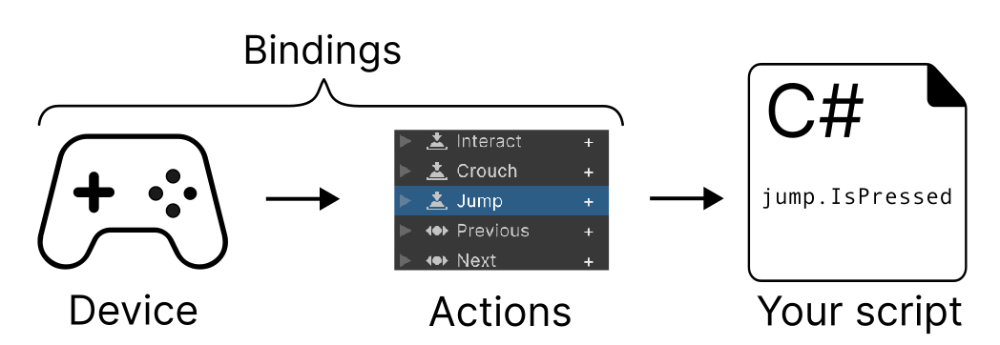
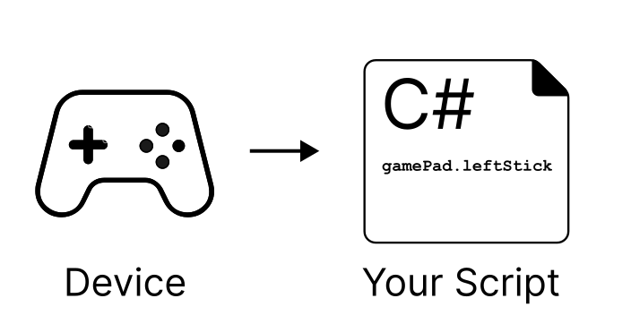

# Input System Workflows

There are multiple ways to use the Input System, however the primary and recommended workflow is to use the **Input Actions** panel in the **Project Settings window** to configure your project-wide Actions and Bindings, get references to those Actions in your code's Start method, then read the values for those actions in your Update method.

There are other workflows which can suit more unusual situations, for example you can use the **PlayerInput component** together with Actions and Bindings which adds a further layer of abstraction, allowing you to connect actions to your event handlers without requiring any intermediate code, and easily handle multiplayer scenarios.

You can choose to configure Actions and Bindings in the Editor UI, or you can set up everything through scripting. Or you can take a more direct approach by omitting the Actions and Bindings features altogether and instead use script to directly read the state of devices.

The descriptions below describe these main workflows and link to more detailed description of them.

|   |   |
|---|---|
|[**Configure Actions in the Editor and read their values from Action references in your script**](Workflow-ProjectWideActions.html)  This is the primary and recommended workflow for most situations. In this workflow, you use the Input Settings window to configure your project-wide actions and bindings, then set up references and read the values for those actions in your code [(read more)](Workflow-ProjectWideActions.html).  ||
|[**Configure input in the Editor, use PlayerInput component to handle events**](Workflow-PlayerInput.html)  This workflow adds more complex functionality on top of the first workflow. It provides features that are useful in multiplayer scenarios such as split-screen or online multiplayer. In addition it provides features that allow you to connect up callbacks directly from Actions to your own callback handler methods, removing the need to deal with Action references in your code. [(read more)](Workflow-PlayerInput.html).  ||
|[**Read user input directly from devices**](Workflow-Direct.html)  This workflow is a simplified, script-only approach which is less abstracted, but also less flexible. It bypasses the Actions and Bindings features entirely, and instead your script explicitly references specific device controls (such as "left gamepad stick") and reads the values directly. This is suitable for fast prototyping, or single fixed platform scenarios [(read more)](Workflow-Direct.html).  ||

> **Note**: Because the Input System has multiple workflows, the code samples used throughout this documentation also vary, often demonstrating techniques using various workflows. For example, some code samples may use Action references, and some may use the workflow of reading input directly from devices.
